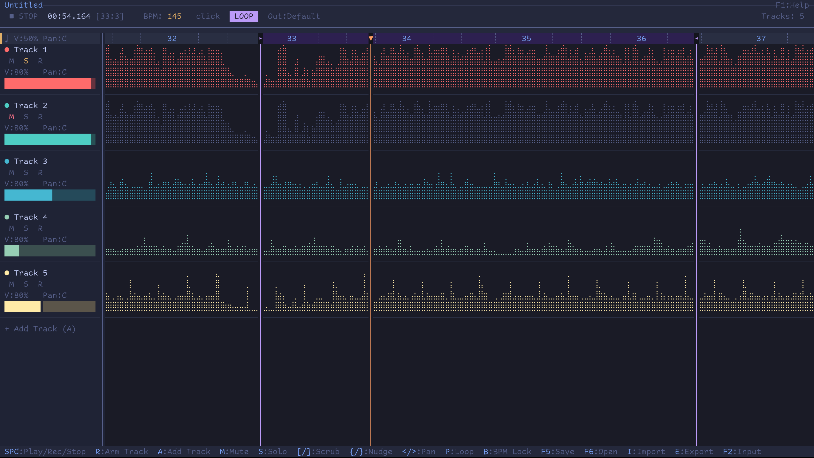
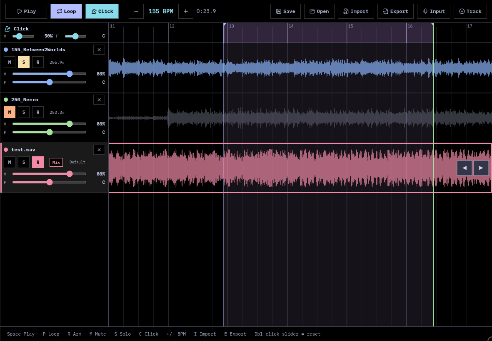

# TUIDAW

A full-featured Digital Audio Workstation with a TUI and a Web UI, built with [OpenTUI](https://opentui.com), [Vue 3.6 Vapor](https://vuejs.org), and [miniaudio](https://miniaud.io).

Practice guitar at half speed without pitch shift. Record multi-track audio. Export mixdowns. From your terminal or browser.

**Web UI: [webdaw.crossatko.dev](https://webdaw.crossatko.dev)**





> **Note:** This project is vibecoded -- built entirely through AI-assisted development for personal use on Arch Linux. It works on my machine, but there are no guarantees of support for other distributions. Contributions and bug reports welcome.

## Features

- **Two UIs** -- terminal (TUI) and browser (Web), sharing the same audio engine
- **Braille waveform display** -- 2x4 dot grid rendering in TUI, Canvas 2D in Web
- **Native audio engine** -- miniaudio C library via Bun FFI (TUI) or WebAssembly (Web)
- **WSOLA time-stretch** -- pitch-preserving speed control (0.25x - 2.0x)
- **Multi-track recording** -- simultaneous capture with per-track input device and channel selection
- **Low-latency input monitoring** -- direct JACK API via dlopen for ~58ms round-trip
- **Metronome click** -- sample-accurate, configurable volume and pan
- **Loop regions** -- sample-accurate looping
- **Beat-based timeline** -- navigate by beats/bars, auto BPM detection on import
- **WAV import** -- 16/24/32-bit, stereo downmix, automatic 48kHz resampling
- **Project save/open** -- `.tuidaw` project files (interoperable between TUI and Web)
- **Export mixdown** -- WAV export via ffmpeg (TUI) or offline WASM render (Web)
- **Mouse & touch controls** -- scroll, volume, pan via mouse wheel or touch

## Web UI

The Web UI runs entirely in the browser -- no server-side audio processing. The same C audio engine is compiled to WebAssembly via Emscripten, and miniaudio uses the Web Audio backend automatically.

**Try it at [webdaw.crossatko.dev](https://webdaw.crossatko.dev)**

- Works on desktop and mobile browsers (Chrome, Firefox, Safari)
- Uses your device's microphone for recording (permission requested on first use)
- Projects saved in the browser are fully compatible with the TUI and vice versa
- PWA installable -- works offline after first load

### Self-hosting the Web UI

```bash
# Development (Vite dev server on port 3666)
bun run dev

# Production build
bun run build:web
# Serve web/dist/ with any static file server
# COOP/COEP headers required for SharedArrayBuffer (see web/public/_headers)
```

## TUI Requirements

- **Linux** (x86_64 or aarch64) -- PipeWire/PulseAudio audio stack required
- [Bun](https://bun.sh) (JavaScript runtime)
- A terminal with Unicode support (Ghostty, Kitty, Alacritty, WezTerm, etc.)
- **ffmpeg** -- for export mixdown
- **zenity** -- for file dialogs

### Linux Audio Stack

The TUI uses miniaudio with the PulseAudio backend, which works with both PipeWire (via pipewire-pulse) and native PulseAudio. Input monitoring uses JACK (via PipeWire's JACK interface or JACK2) for low-latency passthrough. Multi-channel USB audio devices (e.g. Neural DSP Nano Cortex) require PipeWire's Pro Audio profile and are handled via custom ALSA nodes to avoid PipeWire's auto-link corruption.

### Arch Linux

```bash
sudo pacman -S bun ffmpeg zenity
# PipeWire + JACK (usually pre-installed):
sudo pacman -S pipewire pipewire-pulse pipewire-jack
```

### Ubuntu / Debian

```bash
curl -fsSL https://bun.sh/install | bash
sudo apt install ffmpeg zenity pipewire pipewire-pulse pipewire-jack
```

## Quick Start

```bash
git clone https://github.com/crossatko/tuidaw.git
cd tuidaw
./setup.sh
bun run start
```

The setup script will:

1. Check for required system dependencies
2. Download the Zig 0.14.0 toolchain (used to compile the native audio library)
3. Install JS dependencies (`bun install`)
4. Build the native audio library (`libtuidaw_audio.so`)

### Pre-built binary (x86_64 Linux)

If you're on x86_64 Linux, the repo ships a pre-built `native/libtuidaw_audio.so`. You can skip the native build:

```bash
git clone https://github.com/crossatko/tuidaw.git
cd tuidaw
bun install
bun run start
```

### Rebuilding the native library

If you modify `native/tuidaw_audio.c` or need to build for your platform:

```bash
./setup.sh        # downloads Zig if needed, then builds
# or, if Zig is already set up:
cd native && ./build.sh
```

## Keyboard Shortcuts

Press **F1** in the TUI for the full reference. Key shortcuts:

| Key              | Action                                      |
| ---------------- | ------------------------------------------- |
| `Space`          | Play / Stop (record if tracks armed)        |
| `A`              | Add track                                   |
| `D`              | Delete track (two-step: clear, then delete) |
| `R`              | Arm/disarm track for recording              |
| `O`              | Toggle input monitoring                     |
| `M`              | Mute/unmute track                           |
| `S`              | Solo/unsolo track                           |
| `C`              | Toggle metronome click                      |
| `+` / `-`        | Adjust BPM (changes speed via WSOLA)        |
| `B`              | Toggle BPM lock                             |
| `<` / `>`        | Pan left / right                            |
| `V`              | Cycle volume (25/50/75/100%)                |
| `Up` / `Down`    | Select track                                |
| `Left` / `Right` | Scroll timeline (Shift: by bar)             |
| `[` / `]`        | Scrub playhead by 1 bar                     |
| `{` / `}`        | Nudge track by 1/16 beat                    |
| `Home` / `0`     | Jump to beginning                           |
| `End`            | Jump to end                                 |
| `F1`             | Help overlay                                |
| `F2`             | Select input device                         |
| `F3`             | Select output device                        |
| `F5`             | Save project                                |
| `F6`             | Open project                                |
| `I`              | Import WAV                                  |
| `E`              | Export mixdown                              |
| `Q`              | Quit                                        |

## Mouse Controls

| Area              | Action       | Effect                    |
| ----------------- | ------------ | ------------------------- |
| Main waveform     | Scroll wheel | Scroll timeline by beats  |
| Main timeline     | Click        | Set playhead position     |
| Sidebar track     | Scroll wheel | Adjust volume             |
| Sidebar pan zone  | Scroll wheel | Adjust pan                |
| Sidebar click row | Scroll wheel | Adjust click volume / pan |

## Architecture

```
├── index.ts              # Entry dispatcher: --host → Web UI, else → TUI
├── tui.ts                # TUI mode (OpenTUI)
├── src/
│   ├── ui.ts             # OpenTUI rendering
│   ├── audio-engine.ts   # Bun FFI bridge to native library
│   ├── braille.ts        # Braille waveform renderer
│   ├── state.ts          # State management
│   ├── types.ts          # Type definitions and constants
│   └── utils/            # Shared: BPM detection, WAV parsing, DSP
├── web/
│   ├── src/              # Vue 3.6 Vapor components + composables
│   ├── audio-bridge.ts   # WASM audio engine wrapper
│   └── public/           # Static assets, WASM, fonts, PWA
└── native/
    ├── tuidaw_audio.c    # C audio engine (miniaudio, 40+ exports)
    └── miniaudio.h       # miniaudio single-header library
```

## License

MIT License. See [LICENSE](LICENSE).

miniaudio is dual-licensed under Public Domain (Unlicense) and MIT No Attribution.
